<div align="center">

# 🎮 GameZone — Backend API


A production-ready **RESTful Web API** for a full-scale game marketplace platform — built with **ASP.NET Core**, **Entity Framework Core**, **SQL Server**, and **JWT Bearer Authentication**.

**👨‍💻 Author:** Marnissi Ahmed Mustapha &nbsp;|&nbsp; **📅 Last Updated:** May 2026

[](https://github.com/AhmedMustaphaMarnissi)

</div>

---

## ⚡ TL;DR

GameZone Backend is a **complete game store REST API** covering everything a real gaming marketplace needs — authentication, game catalog, purchasing, wishlists, reviews, friend systems, direct messaging, notifications, events, and more. Secured with JWT Bearer tokens, documented through Swagger UI, and structured on a clean 3-tier layered architecture with a 40+ table ERD.

👉 Not a tutorial project — a **fully architected, production-structured backend** with real security, real data relationships, and real API depth.

---

## 💡 Key Highlights

- JWT Bearer Authentication with full token validation (Issuer, Audience, Lifetime, Signature)
- Swagger UI with Bearer security scheme configured for protected endpoint testing
- Clean **3-Tier Architecture**: Presentation (Controllers) → Business Layer → Data Access Layer
- Custom **ExceptionMiddleware** for centralized error handling
- CORS policy configured (`GameZoneApiCorsPolicy`)
- **40+ database tables** with full ERD covering games, users, purchases, friends, notifications, messages, events, reviews, and more
- **15 API controller groups** with 70+ endpoints across GET, POST, PUT, DELETE methods
- Entity Framework Core with Code-First approach
- Environment variable–based secret key management for JWT (`JWT_SECRET_KEY`)

---

## 📋 Table of Contents

- [Overview](#overview)
- [Architecture](#architecture)
- [Project Structure](#project-structure)
- [Database Design (ERD)](#-database-design-erd)
- [Security & Authentication](#-security--authentication)
- [API Reference](#-api-reference)
  - [Auth](#-auth)
  - [Categories](#-categories)
  - [Comments](#-comments)
  - [Companies](#-companies)
  - [Events](#-events)
  - [Feature](#-feature)
  - [Filtration](#-filtration)
  - [Friends](#-friends)
  - [Games](#-games)
  - [Installation](#-installation)
  - [Messages](#-messages)
  - [News](#-news)
  - [Notifications](#-notifications)
  - [PaymentMethods](#-paymentmethods)
  - [PurchasedGames](#-purchasedgames)
  - [Reviews](#-reviews)
  - [Users](#-users)
  - [Validation](#-validation)
  - [Wishlist](#-wishlist)
- [Middleware & Pipeline](#-middleware--pipeline)
- [Tech Stack](#tech-stack)
- [Getting Started](#getting-started)
- [What I Learned](#-what-i-learned)

---

## Overview

**GameZone Backend** is the server-side engine of a full-scale gaming platform similar in scope to Steam or Epic Games Store. It handles every aspect of the platform through clearly separated REST API controllers — from user registration and game browsing, to purchasing, gifting, reviewing, chatting, managing friends, tracking game installations, and receiving notifications.

The API is fully documented via Swagger/OpenAPI and secured with JWT Bearer tokens. All sensitive configuration (secret keys, connection strings) is managed through environment variables. Error handling is centralized in a custom middleware layer that sits before the controller routing in the HTTP pipeline.

---

## Architecture

The solution is organized into **4 projects** following a strict **3-Tier Architecture**:

```
Solution 'GameZoneBack' (4 of 4 projects)
│
├── 📦 Business Layer              → Business logic, service classes
├── 📦 Data Access Layer           → EF Core DbContext, repositories, migrations
├── 📦 Models                      → Entities, DTOs, Enums, Validation
│   ├── Data/
│   │   ├── enums/
│   │   └── GameMarketplaceContext.cs
│   ├── DTO/
│   ├── Entities/
│   └── Validation/
└── 📦 GameZoneBack (API Entry)    → Controllers, Middleware, Program.cs
    ├── Controllers/
    ├── MiddleWare/
    ├── appsettings.json
    └── Program.cs
```

✔️ Separation of concerns &nbsp;|&nbsp; ✔️ Testability &nbsp;|&nbsp; ✔️ Maintainability &nbsp;|&nbsp; ✔️ Scalability

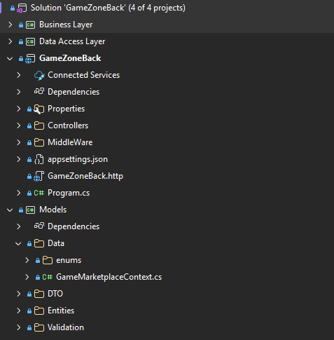

---

## Project Structure

```
GameZoneBack/
│
├── Controllers/                   # 15 API controller groups
├── MiddleWare/
│   └── ExceptionMiddleware.cs     # Global exception handling
├── appsettings.json               # App config (no secrets)
├── GameZoneBack.http              # HTTP test file
└── Program.cs                     # Service registration & HTTP pipeline
```

---

## 🗃️ Database Design (ERD)

The database is designed with **30+ interconnected tables** covering the full domain of a game marketplace. Every relationship is enforced at the database level with proper foreign keys.

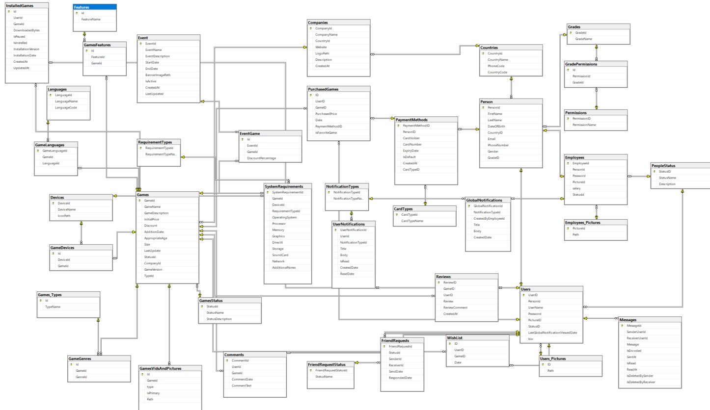

### Core Entity Groups

**🎮 Games Domain**

| Table | Description |
|---|---|
| Games | Core game records: name, description, price, discount, size, version, rating, status |
| Games_Types | Game types (e.g. Action, RPG, Strategy) |
| GameGenres | Junction table linking games to genres |
| GamesStatus | Status lookup: Active, Inactive, Coming Soon |
| GamesFeatures | Junction: games linked to their features |
| Features | Reusable feature tags (e.g. Multiplayer, Cloud Save) |
| GameLanguages | Languages supported per game |
| Languages | Language name and code lookup |
| GameDevices | Devices a game is available on |
| Devices | Device name and icon |
| GamesVidsAndPictures | Media assets (videos and images) per game |
| SystemRequirements | Min/Recommended system specs per game |
| RequirementTypes | Lookup for requirement category names |

**👤 Users & People Domain**

| Table | Description |
|---|---|
| Users | Platform accounts: username, password, picture, bio, status |
| Person | Personal details: name, DOB, country, email, phone, gender, grade |
| Grades | User grade/level system |
| GradePermissions | Permissions tied to each grade level |
| Permissions | Permission name definitions |
| Employees | Staff accounts with salary and status |
| Employees_Pictures | Profile picture paths for employees |
| PeopleStatus | Active/Inactive/Banned status lookup |
| Users_Pictures | Profile picture paths for users |

**🛒 Commerce Domain**

| Table | Description |
|---|---|
| PurchasedGames | Records of every game purchase with price, date, payment method |
| PaymentMethods | Stored cards per user: card number, holder, expiry, type, default flag |
| CardTypes | Card type lookup (Visa, Mastercard, etc.) |
| InstalledGames | Tracks which games a user has installed, download progress, version |
| WishList | Per-user wishlist entries with date added |

**🌐 Social Domain**

| Table | Description |
|---|---|
| FriendRequests | Sent/received friend requests with status and timestamps |
| FriendRequestStatus | Status lookup: Pending, Accepted, Rejected, Blocked |
| Messages | Direct messages between users with read/delete flags |
| Reviews | Per-game user reviews with rating and comment |
| Comments | User comments on game pages |

**🔔 Notifications & Content Domain**

| Table | Description |
|---|---|
| UserNotifications | Per-user notifications with type, title, body, read status |
| GlobalNotifications | Platform-wide notifications created by employees |
| NotificationTypes | Notification category lookup |
| Event | Time-limited game events with banner image and active flag |
| EventGame | Junction: games linked to events with discount percentage |
| Companies | Publisher/developer companies with country and logo |
| Countries | Country name, phone code, and country code |

---

## 🔐 Security & Authentication

The API uses **JWT Bearer Authentication** with strict token validation enforced on every protected endpoint. All auth configuration is handled in `Program.cs` using `AddAuthentication().AddJwtBearer()`.

### JWT Configuration

```csharp
string Secretkey = Environment.GetEnvironmentVariable("JWT_SECRET_KEY") ?? "";

builder.Services.AddAuthentication(JwtBearerDefaults.AuthenticationScheme)
    .AddJwtBearer(options =>
    {
        options.TokenValidationParameters = new TokenValidationParameters
        {
            ValidateIssuer = true,           // Token must come from "GameZoneApi"
            ValidateAudience = true,         // Token must target "GameZoneApiUsers"
            ValidateLifetime = true,         // Token must not be expired
            ValidateIssuerSigningKey = true, // Signature must match the secret key
            ValidIssuer = "GameZoneApi",
            ValidAudience = "GameZoneApiUsers",
            IssuerSigningKey = new SymmetricSecurityKey(
                Encoding.UTF8.GetBytes(Secretkey))
        };
    });
```

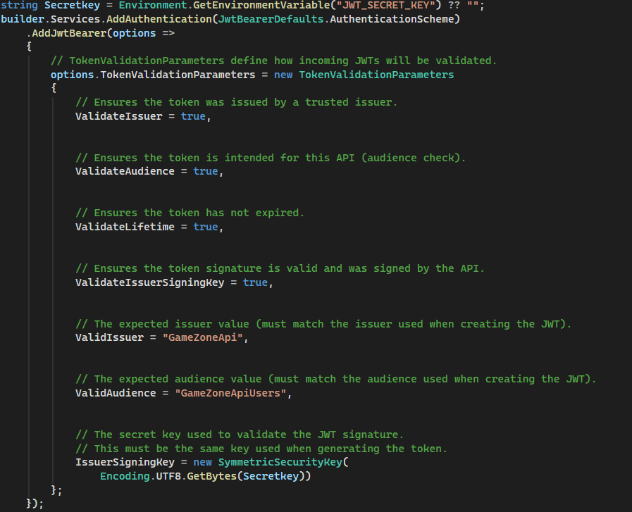

### Swagger Bearer Security Scheme

Swagger UI is configured to support JWT token authorization — allowing developers to authenticate directly inside the documentation interface using the **Authorize** button.

```csharp
options.AddSecurityDefinition("Bearer", new OpenApiSecurityScheme
{
    Name = "Authorization",
    Type = SecuritySchemeType.Http,
    Scheme = "Bearer",
    BearerFormat = "JWT",
    In = ParameterLocation.Header,
    Description = "Enter: Bearer {your JWT token}"
});
```

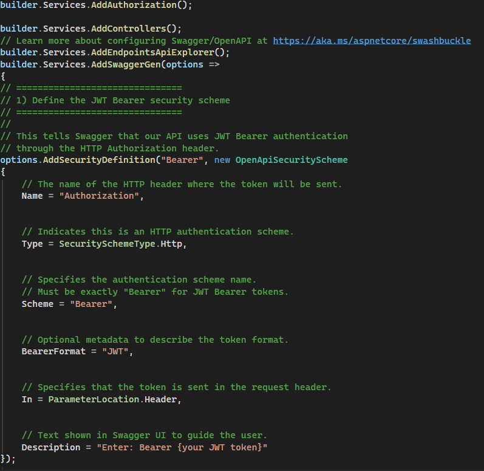

### HTTP Pipeline Order

The middleware pipeline is configured in the correct security-critical order:

```csharp
app.UseHttpsRedirection();
app.UseCors("GameZoneApiCorsPolicy");
app.UseAuthentication();
app.UseAuthorization();
app.UseMiddleware<ExceptionMiddleware>();
app.MapControllers();
```

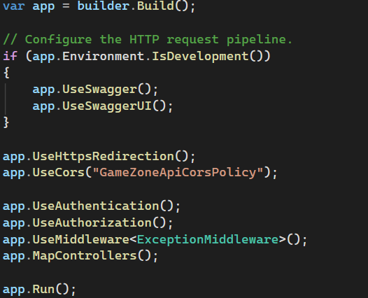

> `UseAuthentication()` must always precede `UseAuthorization()`. The custom `ExceptionMiddleware` sits after auth but before controller routing to catch any runtime exceptions globally.

---

## 📡 API Reference

The full API is documented through **Swagger UI** and organized into **19 controller groups** covering 70+ endpoints. All protected endpoints require a valid JWT Bearer token (shown by the 🔒 lock icon in Swagger).

---

### 🔑 Auth

Entry point for all users — register and log in to receive a JWT token.

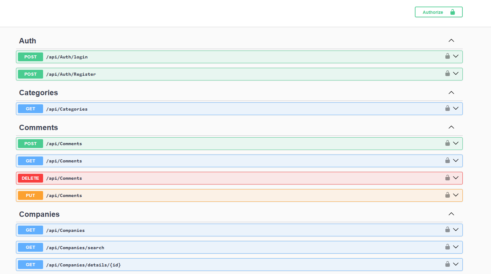

| Method | Endpoint | Description |
|---|---|---|
| POST | `/api/Auth/login` | Authenticate user and return JWT token |
| POST | `/api/Auth/Register` | Register a new user account |

---

### 🗂️ Categories

| Method | Endpoint | Description |
|---|---|---|
| GET | `/api/Categories` | Get all game categories |

---

### 💬 Comments

Full CRUD for user comments on game pages.

| Method | Endpoint | Description |
|---|---|---|
| POST | `/api/Comments` | Add a comment to a game |
| GET | `/api/Comments` | Get all comments |
| DELETE | `/api/Comments` | Delete a comment |
| PUT | `/api/Comments` | Update an existing comment |

---

### 🏢 Companies

Publisher and developer company browsing with search and detail views.

| Method | Endpoint | Description |
|---|---|---|
| GET | `/api/Companies` | Get all companies |
| GET | `/api/Companies/search` | Search companies by name |
| GET | `/api/Companies/details/{id}` | Get detailed info for a specific company |

---

### 🎪 Events

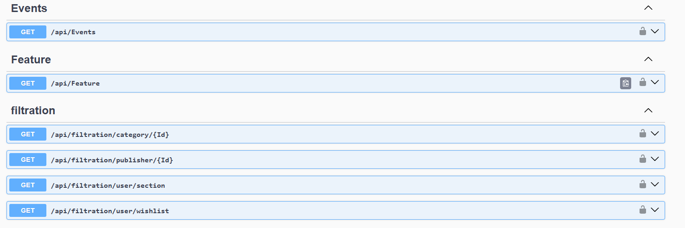

| Method | Endpoint | Description |
|---|---|---|
| GET | `/api/Events` | Get all active platform events |

---

### ⭐ Feature

| Method | Endpoint | Description |
|---|---|---|
| GET | `/api/Feature` | Get all available game features |

---

### 🔍 Filtration

Smart filtering endpoints that scope results to the authenticated user or a specific category/publisher.

| Method | Endpoint | Description |
|---|---|---|
| GET | `/api/filtration/category/{Id}` | Filter games by category ID |
| GET | `/api/filtration/publisher/{Id}` | Filter games by publisher/company ID |
| GET | `/api/filtration/user/section` | Get games scoped to user's library section |
| GET | `/api/filtration/user/wishlist` | Filter games in the user's wishlist |

---

### 👥 Friends

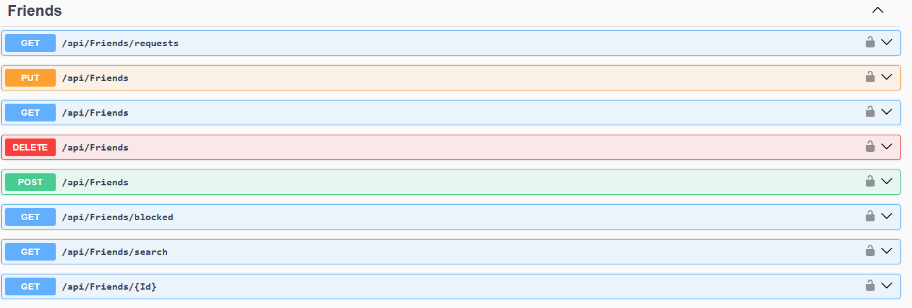

Complete friend management system — requests, blocking, searching, and removal.

| Method | Endpoint | Description |
|---|---|---|
| GET | `/api/Friends/requests` | Get all pending friend requests |
| PUT | `/api/Friends` | Accept or respond to a friend request |
| GET | `/api/Friends` | Get the authenticated user's friend list |
| DELETE | `/api/Friends` | Remove a friend |
| POST | `/api/Friends` | Send a friend request |
| GET | `/api/Friends/blocked` | Get all blocked users |
| GET | `/api/Friends/search` | Search users by name or username |
| GET | `/api/Friends/{Id}` | Get details of a specific friend |

---

### 🎮 Games

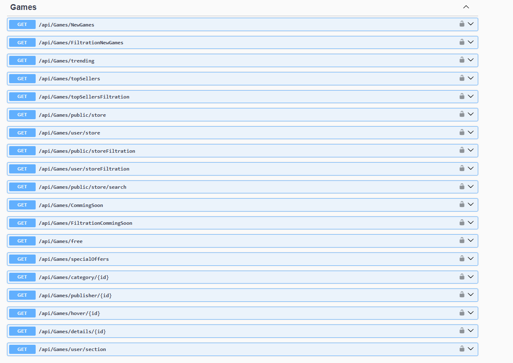

The largest and most feature-rich controller — covering every way a user can browse and discover games in the store.

| Method | Endpoint | Description |
|---|---|---|
| GET | `/api/Games/NewGames` | Get recently added games |
| GET | `/api/Games/FiltrationNewGames` | Filtered new games |
| GET | `/api/Games/trending` | Get trending games |
| GET | `/api/Games/topSellers` | Get top-selling games |
| GET | `/api/Games/topSellersFiltration` | Filtered top sellers |
| GET | `/api/Games/public/store` | Public store listing (no auth required) |
| GET | `/api/Games/user/store` | Store listing personalized for logged-in user |
| GET | `/api/Games/public/storeFiltration` | Filter the public store |
| GET | `/api/Games/user/storeFiltration` | Filter the user-personalized store |
| GET | `/api/Games/public/store/search` | Search games in the public store |
| GET | `/api/Games/CommingSoon` | Get upcoming / coming soon games |
| GET | `/api/Games/FiltrationCommingSoon` | Filtered coming soon games |
| GET | `/api/Games/free` | Get free-to-play games |
| GET | `/api/Games/specialOffers` | Get games with active discounts |
| GET | `/api/Games/category/{id}` | Get games by category |
| GET | `/api/Games/publisher/{id}` | Get games by publisher |
| GET | `/api/Games/hover/{id}` | Get quick hover preview data for a game |
| GET | `/api/Games/details/{id}` | Get full game detail page data |
| GET | `/api/Games/user/section` | Get user's library organized by section |

---

### 💾 Installation

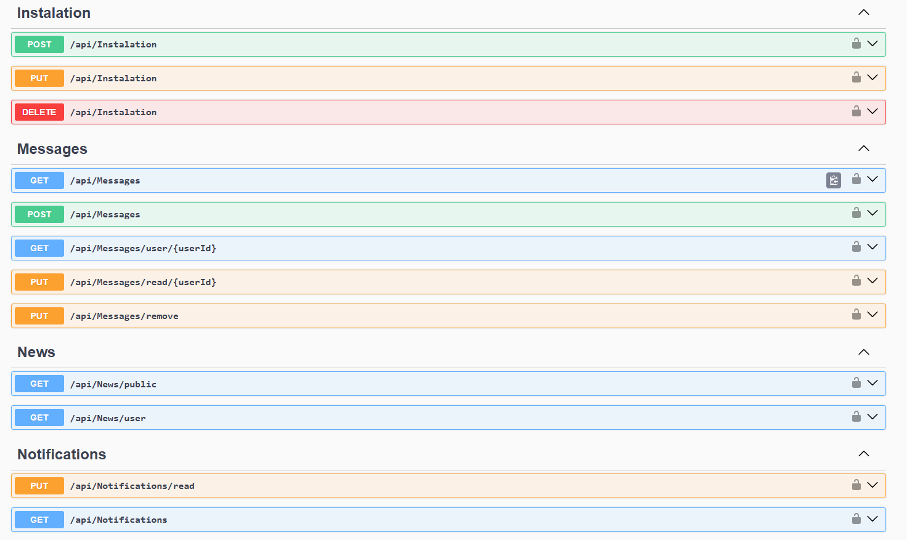

Track and manage game installations per user.

| Method | Endpoint | Description |
|---|---|---|
| POST | `/api/Instalation` | Register a new game installation |
| PUT | `/api/Instalation` | Update installation status (pause, resume, progress) |
| DELETE | `/api/Instalation` | Remove a game installation record |

---

### 📩 Messages

Full direct messaging between users with read receipts and soft-delete support.

| Method | Endpoint | Description |
|---|---|---|
| GET | `/api/Messages` | Get all messages for the authenticated user |
| POST | `/api/Messages` | Send a new message |
| GET | `/api/Messages/user/{userId}` | Get conversation with a specific user |
| PUT | `/api/Messages/read/{userId}` | Mark all messages from a user as read |
| PUT | `/api/Messages/remove` | Soft-delete a message (remove for sender) |

---

### 📰 News

| Method | Endpoint | Description |
|---|---|---|
| GET | `/api/News/public` | Get public news feed (no auth required) |
| GET | `/api/News/user` | Get personalized news for logged-in user |

---

### 🔔 Notifications

| Method | Endpoint | Description |
|---|---|---|
| PUT | `/api/Notifications/read` | Mark notifications as read |
| GET | `/api/Notifications` | Get all notifications for the authenticated user |

---

### 💳 PaymentMethods

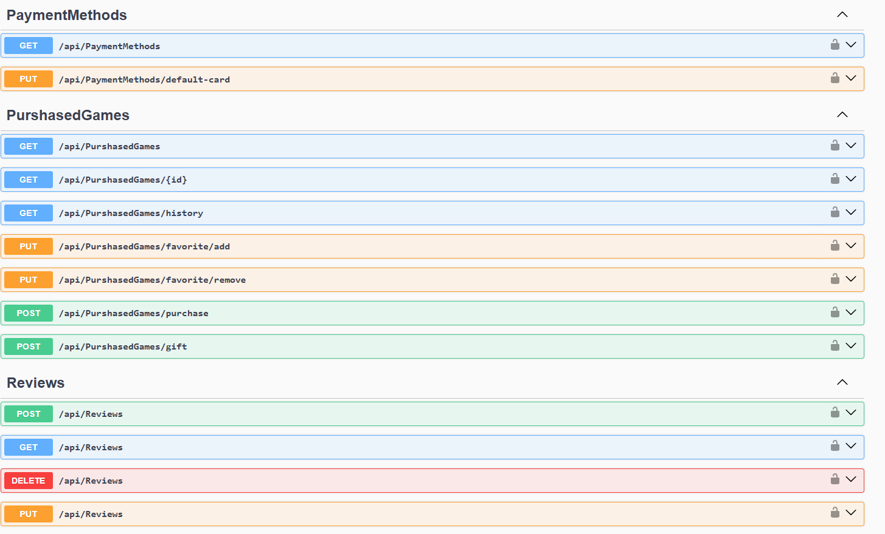

| Method | Endpoint | Description |
|---|---|---|
| GET | `/api/PaymentMethods` | Get all stored payment methods for the user |
| PUT | `/api/PaymentMethods/default-card` | Set a card as the default payment method |

---

### 🛒 PurchasedGames

Complete purchasing flow — buy, gift, track history, and manage favorites.

| Method | Endpoint | Description |
|---|---|---|
| GET | `/api/PurshasedGames` | Get all purchased games for the user |
| GET | `/api/PurshasedGames/{id}` | Get details of a specific purchased game |
| GET | `/api/PurshasedGames/history` | Get full purchase history |
| PUT | `/api/PurshasedGames/favorite/add` | Mark a purchased game as favorite |
| PUT | `/api/PurshasedGames/favorite/remove` | Remove a game from favorites |
| POST | `/api/PurshasedGames/purchase` | Purchase a game |
| POST | `/api/PurshasedGames/gift` | Gift a purchased game to another user |

---

### ⭐ Reviews

| Method | Endpoint | Description |
|---|---|---|
| POST | `/api/Reviews` | Submit a review for a game |
| GET | `/api/Reviews` | Get reviews |
| DELETE | `/api/Reviews` | Delete a review |
| PUT | `/api/Reviews` | Update an existing review |

---

### 👤 Users

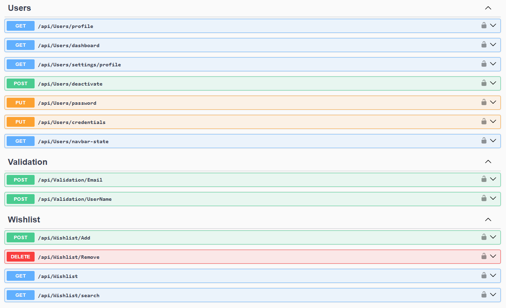

Account management — profile, credentials, password, and navbar state.

| Method | Endpoint | Description |
|---|---|---|
| GET | `/api/Users/profile` | Get the authenticated user's profile |
| GET | `/api/Users/dashboard` | Get user dashboard data |
| GET | `/api/Users/settings/profile` | Get editable profile settings |
| POST | `/api/Users/deactivate` | Deactivate the user account |
| PUT | `/api/Users/password` | Change the user's password |
| PUT | `/api/Users/credentials` | Update username or email |
| GET | `/api/Users/navbar-state` | Get notification/friend request counts for the navbar |

---

### ✅ Validation

Real-time uniqueness validation before form submission — prevents duplicate registrations.

| Method | Endpoint | Description |
|---|---|---|
| POST | `/api/Validation/Email` | Check if an email address is already taken |
| POST | `/api/Validation/UserName` | Check if a username is already taken |

---

### 💝 Wishlist

| Method | Endpoint | Description |
|---|---|---|
| POST | `/api/Wishlist/Add` | Add a game to the wishlist |
| DELETE | `/api/Wishlist/Remove` | Remove a game from the wishlist |
| GET | `/api/Wishlist` | Get the authenticated user's wishlist |
| GET | `/api/Wishlist/search` | Search within the wishlist |

---

## ⚙️ Middleware & Pipeline

### ExceptionMiddleware

A custom middleware class registered in the HTTP pipeline to catch all unhandled runtime exceptions before they reach the client. Instead of exposing raw stack traces, it returns structured JSON error responses with appropriate HTTP status codes.

```
Request → HTTPS Redirect → CORS → Authentication → Authorization
       → ExceptionMiddleware → Controllers → Response
```

### CORS

CORS is configured with a named policy (`GameZoneApiCorsPolicy`) registered in `Program.cs`, allowing controlled cross-origin access for the frontend client.

### Swagger

Available only in the **Development** environment:

```csharp
if (app.Environment.IsDevelopment())
{
    app.UseSwagger();
    app.UseSwaggerUI();
}
```

---

## Tech Stack

| Layer | Technology |
|---|---|
| Language | C# (.NET) |
| Framework | ASP.NET Core Web API |
| ORM | Entity Framework Core |
| Database | Microsoft SQL Server |
| Authentication | JWT Bearer Tokens |
| API Documentation | Swagger / OpenAPI (Swashbuckle) |
| Architecture | 3-Tier (Controllers / Business / Data Access) |
| IDE | Visual Studio |

---

## Getting Started

### Prerequisites

- Windows OS
- Visual Studio 2022 or later
- SQL Server (LocalDB or full instance)
- .NET 6 / 7 / 8 SDK

### Setup

1. **Clone the repository:**
   ```bash
   git clone https://github.com/ahmedmustaphamarnissi/GameZone-Backend.git
   cd GameZone-Backend
   ```

2. **Set the JWT secret key as an environment variable:**
   ```bash
   # Windows (PowerShell)
   $env:JWT_SECRET_KEY = "your-strong-secret-key-here"

   # Windows (CMD)
   set JWT_SECRET_KEY=your-strong-secret-key-here
   ```

3. **Update the connection string** in `appsettings.json` to point to your SQL Server instance.

4. **Apply database migrations:**
   ```bash
   dotnet ef database update
   ```

5. **Set the startup project** to `GameZoneBack` in Visual Studio.

6. **Build and run** with `F5` — Swagger UI will open automatically in development mode.

7. **Authenticate in Swagger:** Click the **Authorize** button, register or log in via `/api/Auth/Register` and `/api/Auth/login`, then paste your JWT token as `Bearer {token}` to access protected endpoints.

---

## 🧠 What I Learned

- Designing a large-scale relational database with 30+ tables and complex many-to-many relationships
- Implementing JWT Bearer Authentication with full token validation in ASP.NET Core
- Configuring Swagger with a custom Bearer security scheme for authenticated API documentation
- Building a clean 3-tier architecture across 4 separate Visual Studio projects
- Writing a custom `ExceptionMiddleware` for centralized, structured error handling
- Designing RESTful endpoints that distinguish between public and authenticated access
- Managing environment-based secrets securely without hardcoding sensitive values
- Building a friend system, messaging system, notification system, and purchase/gifting flow as separate API controllers
- Structuring a real-world domain model where users, games, purchases, events, and social features all interconnect

---

<div align="center">

Built with ❤️ in Bizerte, Tunisia 🇹🇳

[](https://github.com/AhmedMustaphaMarnissi)

</div>
